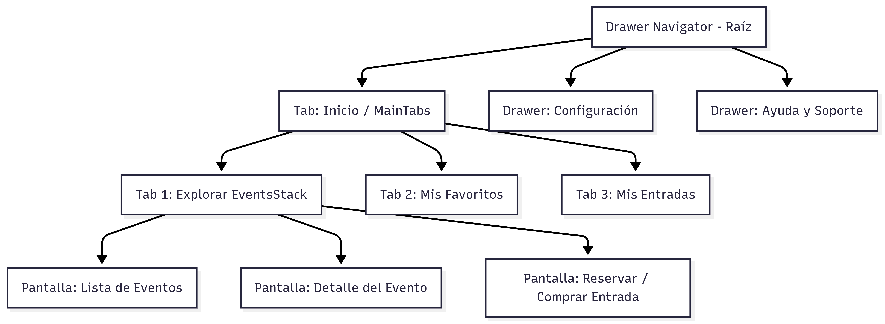

Aquí tienes una propuesta de ejercicio práctico y realista estructurada como una **Tarea / Práctica Dirigida**.

---

# 📋 Tarea Práctica: Desarrollo de Aplicación de Gestión de Eventos y Entradas ("Eventify")

## 🎯 Objetivo

Diseñar e implementar la infraestructura de navegación para la aplicación móvil **"Eventify"** utilizando **React Navigation**, combinando de forma anidada **Drawer Navigator**, **Bottom Tabs Navigator** y **Stack Navigator** con TypeScript.

---

## 🏬 Contexto del Proyecto

**Eventify** es una plataforma donde los usuarios pueden explorar eventos culturales/musicales, ver detalles del evento, reservar entradas y gestionar sus preferencias de usuario desde un menú lateral de configuración.

---

## 🏗️ Arquitectura y Jerarquía de Navegación

La aplicación debe estructurarse en **3 niveles de anidamiento**:



---

## 📝 Requerimientos Detallados

### 1. Drawer Navigator (Navegador Principal / Raíz)

Debe ser el contenedor principal de la aplicación con un menú lateral personalizable:

- **Pestaña Principal (`MainTabs`)**: Carga el `BottomTabNavigator`.
- **Configuración (`Settings`)**: Abre la pantalla o flujo de ajustes de usuario.
- **Soporte (`Support`)**: Abre la pantalla de ayuda o preguntas frecuentes.
- **Header / Custom Drawer**: Debe incluir un encabezado personalizado en el Drawer que muestre el avatar, nombre del usuario y correo.

### 2. Bottom Tabs Navigator (Navegación Inferior)

Dentro de la opción `MainTabs` del Drawer, se muestra una barra de pestañas en la parte inferior:

- **Explorar (`EventsTab`)**: Contiene el `EventsStackNavigator` (Stack de eventos).
- **Favoritos (`FavoritesTab`)**: Lista de eventos guardados por el usuario.
- **Mis Entradas (`MyTicketsTab`)**: Lista de entradas compradas o tickets activos.
- **Iconos y Estilos**: Cada tab debe tener un icono descriptivo y cambiar de color cuando esté activo.

### 3. Stack Navigator (`EventsStackNavigator`)

Dentro del tab **Explorar**, debe existir un flujo de navegación Stack:

- **`EventListScreen`**:
  - Muestra una lista de eventos (usar datos simulados `mock`).
  - Al hacer clic en una tarjeta de evento, navega a `EventDetailScreen` pasando el `id` o datos del evento por parámetros.
- **`EventDetailScreen`**:
  - Muestra la información completa del evento (imagen, fecha, ubicación, descripción).
  - Incluye un botón **"Reservar Entrada"** que navega a `BookingScreen`.
- **`BookingScreen`**:
  - Formulario básico para seleccionar cantidad de entradas y confirmar la reserva.
  - Botón para **"Confirmar y Volver a Inicio"** (debe resetear o regresar a la lista de eventos).

---

## 💡 Tipado TypeScript Requerido

Debes definir los tipos de parámetros para cada navegador:

```typescript
// Ejemplo de estructura de tipos requerida:
export type RootDrawerParamList = {
  MainTabs: undefined;
  Settings: undefined;
  Support: undefined;
};

export type MainTabParamList = {
  EventsTab: undefined;
  FavoritesTab: undefined;
  MyTicketsTab: undefined;
};

export type EventsStackParamList = {
  EventList: undefined;
  EventDetail: { eventId: string; title: string };
  Booking: { eventId: string; title: string };
};
```
